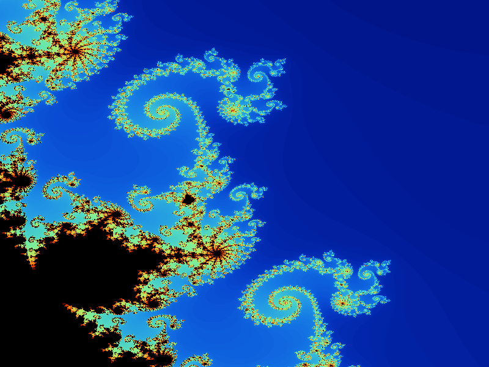
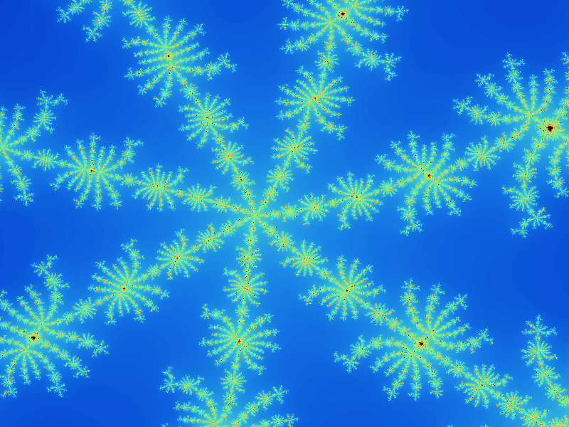
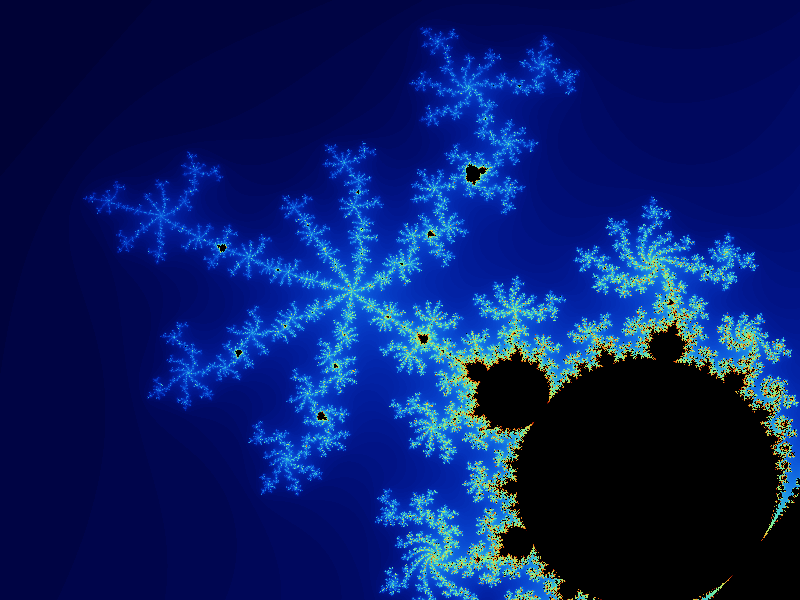

# Mandelbrot Fractal Visualizer: An interactive Rust Application to explore the Mandelbrot and Julia Sets


Date: 13 Sept 2025

Oliver Bonham-Carter

Email: obonhamcarter at allegheny.edu

This project is an interactive desktop application written in Rust for visualizing and exploring the Mandelbrot and Julia fractals. It allows users to zoom, change color palettes (including user-defined gradients), save high-resolution images, and export/import favorite views.

## Table of Contents

- [Mandelbrot Fractal Visualizer: An interactive Rust Application to explore the Mandelbrot and Julia Sets](#mandelbrot-fractal-visualizer-an-interactive-rust-application-to-explore-the-mandelbrot-and-julia-sets)
  - [Table of Contents](#table-of-contents)
  - [Project Structure](#project-structure)
  - [Features](#features)
  - [What is the Mandelbrot Fractal?](#what-is-the-mandelbrot-fractal)
  - [Julia Set: Example Values to Try](#julia-set-example-values-to-try)
    - [Quick Start](#quick-start)
  - [Controls](#controls)
    - [Tips](#tips)
  - [Requirements](#requirements)
  - [Tips](#tips-1)
  - [License](#license)
  - [Contributing](#contributing)
    - [A Work In Progress](#a-work-in-progress)

## Project Structure

The codebase is modular and organized for easy maintenance:

- `src/types.rs`: Shared types and enums (fractal view, palette, etc.)
- `src/palette.rs`: Color palette logic and user palette support
- `src/fractal.rs`: Mandelbrot and Julia rendering functions
- `src/save.rs`: Image saving and favorite export/import logic
- `src/app.rs`: Main application state and UI logic (egui)
- `src/main.rs`: Entry point (minimal, just launches the app)

If you want to extend or modify the app, start by looking at `src/app.rs` for UI and state, and the other modules for rendering and palette logic.



## Features

- Interactive Mandelbrot and Julia fractal rendering
- Mouse-based zoom and zoom-out
- Multiple built-in color palettes (including user-defined gradients)
- Save PNG and high-resolution PNG images
- All images saved in the `0_fractals/` directory with unique filenames
- Export/import favorite views and palettes as JSON
- Reset view to initial state

## What is the Mandelbrot Fractal?

The Mandelbrot set is a famous mathematical set of points in the complex plane, the boundary of which forms a fractal. It is defined by iterating the function:

  z_{n+1} = z_n^2 + c

where `z` and `c` are complex numbers, and starting with `z_0 = 0`. The set contains all points `c` for which the sequence does not tend to infinity. The resulting image is known for its intricate, self-similar patterns and infinite complexity.

## Julia Set: Example Values to Try

The Julia set is a related fractal, but instead of varying `c` for each pixel, you fix `c` and iterate for each point in the complex plane. The shape of the Julia set changes dramatically depending on the value of `c`.

Try these example values for `c = (re, im)` in Julia mode:

- **Classic connected set:**
  - `(-0.8, 0.156)` (default)
  - `(-0.4, 0.6)`
  - `(0.285, 0.01)`
- **Disconnected/dusty sets:**
  - `(0.285, 0.013)`
  - `(0.45, 0.1428)`
  - `(-0.70176, -0.3842)`
- **Spiral/filament shapes:**
  - `(-0.835, -0.2321)`
  - `(-0.8, 0.156)`
  - `(0.355, 0.355)`
- **Other interesting values:**
  - `(0.37, 0.1)`
  - `(-0.54, 0.54)`
  - `(0.3, 0.5)`

Experiment with the real and imaginary sliders to discover new shapes!



### Quick Start

1. **Run the application:**

  ```sh
  cargo run
  ```

2. **Zoom:** Use the mouse to drag a rectangle over the fractal to zoom in. Use "Zoom Out" or "Reset View" to navigate.

3. **Color Palettes:** Select from built-in or user-defined palettes in the dropdown. For user-defined, pick two colors for a gradient.

4. **Fractal Type:** Toggle between Mandelbrot and Julia sets. In Julia mode, adjust the `c` parameter for different shapes.

5. **Save Images:** Use "Save PNG" or "Save High-Res PNG" to save images in the `0_fractals/` directory (created automatically).

6. **Export/Import Favorites:** Save or load favorite views and palettes as JSON files for easy sharing or restoration.


## Controls

- **Zoom:** Click and drag on the fractal image to select a region to zoom in.
- **Zoom Out:** Click the "Zoom Out" button to double the current view.
- **Reset View:** Click the "Reset View" button to return to the default view.
- **Palette:** Use the "Color Palette" dropdown to change the color scheme.
- **Fractal Type:** Toggle between Mandelbrot and Julia sets using the selector.
- **Julia Parameters:** When Julia is selected, adjust the real and imaginary parts of `c`.
- **Save PNG:** Save the current view as a PNG in `0_fractals/`.
- **Save High-Res PNG:** Save a 3200x2400 PNG (shows a progress spinner while rendering).
- **Export Favorite:** Save the current view, palette, and fractal type as a JSON file in `0_fractals/`.
- **Import Favorite:** Load the most recent favorite JSON from `0_fractals/`.

### Tips

- All images and favorites are saved in the `0_fractals/` directory.
- The UI is responsive; if a high-res save is in progress, a spinner will appear.
- To extend the app, see the modular source files in `src/`.

## Requirements

- Rust toolchain
- Runs on macOS, Linux, and Windows



## Tips

- All saved images and favorites are stored in the `0_fractals/` directory.
- High-res rendering may take several seconds; a spinner will indicate progress.
- You can edit the exported JSON files to share or tweak favorite views.

---

## License

This project is licensed under the MIT License. See the LICENSE file for details.

## Contributing

Contributions are welcome! If you have ideas for improvements or want to add more features, feel free to open an issue or submit a pull request.

### A Work In Progress

Check back often to see the evolution of the project! This project is a work-in-progress. Updates will come periodically.

If you would like to contribute to this project, please do! For instance, if you see some low-hanging fruit or tasks that could add value to the project, I would love to have your insight.

Otherwise, please create an issue for bugs or errors. Since I am a teaching faculty member at Allegheny College, I may not have all the time necessary to quickly fix bugs. I welcome the Open Source Community to further the development of this project. Much thanks in advance.

If you appreciate this project, please consider clicking the project's Star button. :-)
